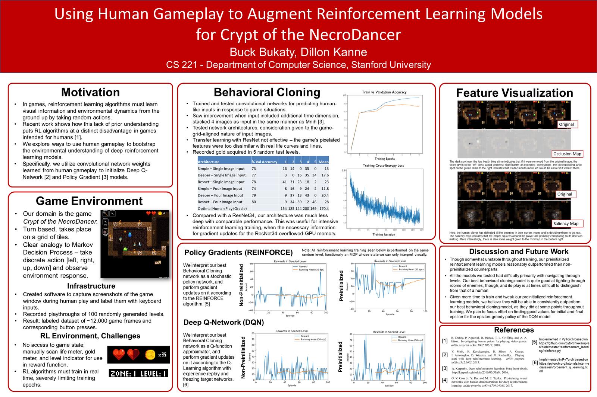
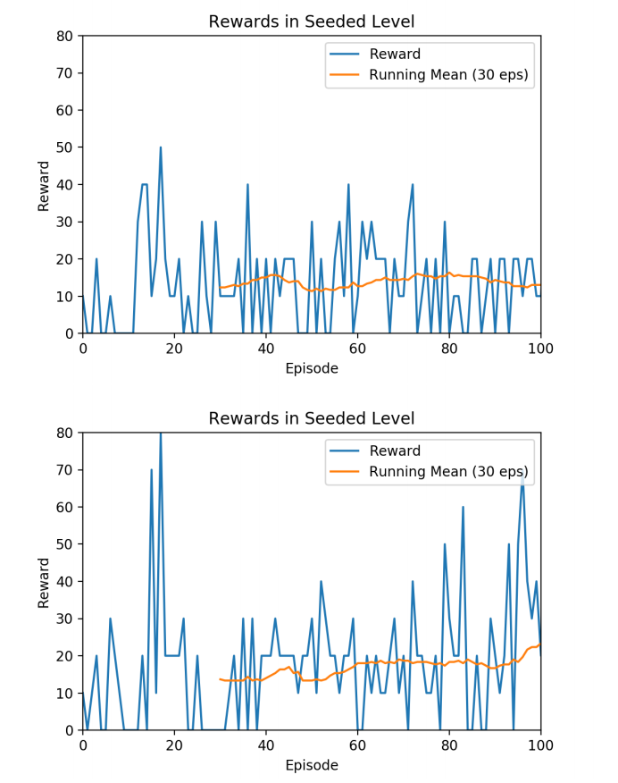

# Crypt of the NecroDancer Bot
In this project for the class [CS231N](http://cs231n.stanford.edu/2018/), Amy Kanne and I explored using convolutional neural networks combined with reinforcement learning to play the game *Crypt of the NecroDancer*. Here, I give a fairly beginner-friendly explanation of some of the cool things we explored.

## For a quick summary, check out our poster!

[**PDF Version**](poster.pdf)
…or to get into the details right away, check out [our report](report.pdf).

# Motivation

Modern learning algorithms often use convolutional neural networks (CNNs) to ‘see’ their environment, whether that environment is real (seen through a camera) or virtual. These neural networks start out untrained, meaning the algorithm has no idea what it’s looking at and what visual cues are relevant to decision making. To prevent an AI from needing to learn how to interpret visual information from scratch, we explored ways of imbuing them with prior knowledge about their environment.

In many environments, one readily available source of such prior knowledge is human gameplay. In a video game, for example, a dataset of recorded human gameplay could consist of screen captures of the game associated with the buttons that the human player was pressing, and should be fairly easy to acquire from normal human play. We recorded such a dataset for the game *Crypt of the NecroDancer*, and used it to experiment with ‘bootstrapping’ the training process for several different AI agents.

A quick note about *Crypt of the NecroDancer:* normally it’s a rhythm game, in which skill is determined by the quality of the decisions you make in a short time period (one beat of the song). As you can see in the gif above, disabling the rhythm component turns the game into more of a strategic endeavor, a good testbed for an algorithmic agent.

# Project Methodology

The first thing we do is use our gameplay dataset to train a CNN that, given an image of the game, can output a prediction of what button a human would press based on trends in the data. Using this CNN’s predictions to play the game is a technique referred to as **Behavioral Cloning,** as the algorithm is essentially mimicing the human gameplay it has seen. 

There are several major downsides to Behavioral Cloning, however. First and foremost, the algorithmic ‘agent’ doesn’t actually *understand* the game at all. It has no conception of how well it is performing, and it will never be able to learn what move is *best* in a given situation - it can only tell you what it thinks the human player would have done. This means it won’t do well in situations that a human never saw in the training dataset (neural networks try to ‘generalize’ to unseen situations, but complicated games can exceed their capacity to do so). Finally, it will never try new things and learn new strategies - its output is completely deterministic.

This is where **Reinforcement Learning** comes in!

There are already tons of great resources online explaining RL, so I’ll keep it real simple. In Reinforcement Learning, an agent takes actions in the environment, and receives some reward as a result. The goal is to get as many rewards as possible. That’s a very broad problem specification, but the important thing for us is we’re giving an agent information about its performance, which it can use to improve itself. 

So Reinforcement Learning normally looks like this: an agent flails around semi-randomly for thousands (or even millions!) of training epochs, slowly learning which actions are better in terms of a defined system of rewards, until it eventually starts performing really well. While this approach (combined with some clever math and software engineering) has actually achieved [superhuman performance on a variety of Atari games](https://www.youtube.com/watch?v=V1eYniJ0Rnk&vl=en), we wanted to try to skip the flailing part. So, here’s our approach.
 
While previously we were training the Behavioral Cloning CNN to maximize accuracy on our gameplay dataset, we now let it loose in the actual game and monitor the rewards it receives every time it plays through a level. For *Crypt of the NecroDancer,* we give the agent a positive reward when it collects gold and a large positive reward if it reaches the end of the level. Now we train the CNN according to these rewards received using an RL algorithm like [Policy Gradients](http://karpathy.github.io/2016/05/31/rl/) or [Q-Learning](https://medium.com/emergent-future/simple-reinforcement-learning-with-tensorflow-part-0-q-learning-with-tables-and-neural-networks-d195264329d0) (we tried both).

More technical details, related work, additional discussion and more can be found in [**our report**](report.pdf).

# Results

When using our Behavioral Cloning model as a starting point for RL, it was qualitatively clear that the agent explored the environment in a more useful way. For example, without pre-training, the model would often hit a wall with the shovel repeatedly until the episode timed out, resulting in zero reward. However, the pre-trained model might run through a fair portion of the level, killing one enemy but missing its dropped gold (and thus the reward it should have gotten), then dying to a spike trap or in a complicated combat encounter.

*Q-Learning RL agent performance on a level over the training period. Below: RL agent preinitialized with Behavioral Cloning model. Above: no preinitialization.*

This provides some intuition for why our quantitative results, seen in the figure above, express only a subtle difference. Nonetheless, the higher variance of the pretrained model’s rewards, combined with the increase in average reward towards the end of the training period, gives us confidence in the efficacy of our pretraining technique.

# Lessons Learned

One thing that surprised us was how effective our ‘starting point’ Behavioral Cloning model could be as game-playing agents on its own. Training a modern CNN (a Resnet-18) on our dataset of recorded human gameplay left us with a very reasonable game-playing agent whose behaviors were comparable to those of a novice player, footage of which can be [**seen here**](https://www.youtube.com/watch?v=8Quvjy1_GfY).

This success is notable in that it required significantly less infrastructure to implement than the Reinforcement Learning techniques we subsequently explored. The screen-and-input capture methodology we used to acquire our gameplay dataset and train our models could in theory be easily extended to many different types of games and environments with little knowledge about the specifics of those environments. In contrast, applying RL to *Crypt of the NecroDancer* required us to use our knowledge of the game to design and implement a suitable reward function, which involved scanning pixels from the screen to check, after every action, if the agent had gained gold or made it to the end of the level.

The biggest difficulty we encountered in the course of the project was our lack of access to a simulator of the game. Many RL environments, including Atari games as previously mentioned, can be simulated in a way that allows you to run the environment much faster than real-time, greatly accelerating the training process. So for us, using the game in real time, an epoch (one playthrough of a level in the game) could take anywhere from 30 seconds to a few minutes, severely limiting the amount of RL training we could perform.

## In conclusion…

This was a really fun project, in which Amy and I got to apply the things we’d been learning in our AI classes to a domain that we were both interested in. Simple behavioral cloning models that mimicked human gameplay exceeded expectations, and we had a good time naming our Behavioral Cloning model Henry and watching its hapless adventures in randomly generated levels of the game. Attempts to use Behavioral Cloning models as a starting point for more intelligent reinforcement learning algorithms were not quite as successful as we had hoped, especially due to technical limitations of the training process, but nonetheless validated the intuition of the project that such a strategy is promising.

